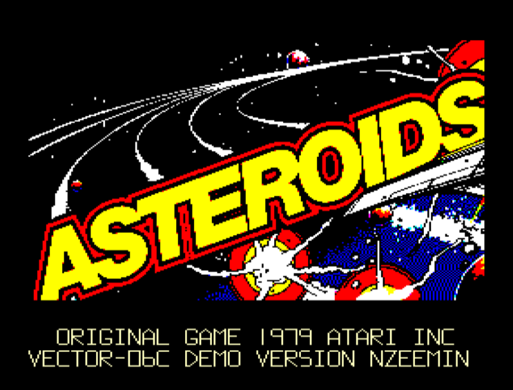
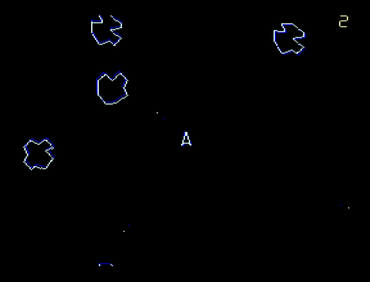

# vector06c-asteroids
Porting **Asteroids** game to soviet computer [Vector-06c](https://en.wikipedia.org/wiki/Vector-06C) (Вектор-06Ц).

Thanks a lot to [zx-pk.ru forum](https://zx-pk.ru/forums/55-vektor.html) members for all the help and support!

Porting status: Work In Progrss.

 

## Tools for the tools folder

 - `pasmo.exe` cross-assembler
   http://pasmo.speccy.org/

 - `tasm.exe` compatible with Windows 10 + `TASM85.TAB`
   http://old-dos.ru/dl.php?id=1926

 - `lzsa.exe`
   https://github.com/emmanuel-marty/lzsa/releases

## Links

 - [Discussion on zx-pk.ru (in Russian)](https://zx-pk.ru/threads/33430-portirovanie-asteroids.html)

